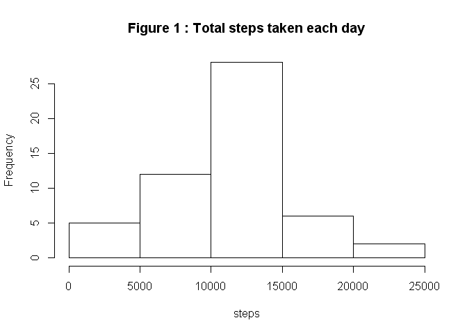

# Reproducible Research: Peer Assessment 1

  
## Loading and preprocessing the data
  

```r
# dataFrame data is equivalent to sInIntervalOnDate (steps in given interval on specific Date)
#
workDir<- "C:/Documents and Settings/Parents/My Documents/My R/Reproducible Research/RepData_PeerAssessment1"
dataFile<- "activity/activity.csv"

setwd(workDir)
data<- read.csv(dataFile)
```
  
  
## What is mean total number of steps taken per day?  
  1. Calculate total steps taken per day, ignoring missing values  
  2. Make histogram of total steps taken each day  
  3. Report mean and median of total steps taken each day  
  

```r
attach(data)
      # steps on a given Date totaled across intervals on each day
      #
      sOnDate<- aggregate(steps~date ,FUN=sum)  
detach(data)

attach(sOnDate)
      hist(steps ,main = "Figure 1 : Total steps taken each day")
```

 

```r
      paste("Mean of total steps taken each day:", mean(steps))
```

```
## [1] "Mean of total steps taken each day: 10766.1886792453"
```

```r
      paste("Median of total steps taken each day:", median(steps))
```

```
## [1] "Median of total steps taken each day: 10765"
```

```r
detach(sOnDate)
```
  
### Analysis results:
#### &nbsp;&nbsp;&nbsp;&nbsp; Mean of total steps taken each day: 10766.1886792453
#### &nbsp;&nbsp;&nbsp;&nbsp; Median of total steps taken each day: 10765
#### &nbsp;&nbsp;&nbsp;&nbsp; For histogram of total steps taken each day, see accompanying Figure 1
<br>

  
## What is the average daily activity pattern?  
  (III) 1. Time series plot of interval (x-axis) and average steps taken, across days (y-axis)  
      2. 5-minute interval, on average across days, that contains maximum number of steps  
  

```r
attach(data)
      # steps in a given Interval averaged across all dates
      #
      sInIntervalAvg<- aggregate(steps~interval ,FUN=mean)     
detach(data)

## Time series plot of interval (x-axis) and average steps taken, across days (y-axis)
#
attach(sInIntervalAvg)
      #     convert interval hmm to minutes using by adding modulo(interval,100) to 60*floor(interval/100)
      #
      plot( (60 * interval %/%100 + (interval %%100) ), steps ,type="l" 
            , xlab="beginning of 5-minute interval in minutes after midnight"
            , main = "Figure 2 : Time series steps by interval")
```

 

```r
detach(sInIntervalAvg)

## 5-minute interval, on average across days, that contains maximum number of steps
#     get maximum from set of steps in intervals (where steps in each interval averaged across days)
#
      maxStepsInInterval<- max( sInIntervalAvg[2] )   

#     get interval corresponding to maximum steps, then report
#
      intervalMaxSteps<- sInIntervalAvg[ sInIntervalAvg$steps==maxStepsInInterval ,"interval" ]

#     output interval as hh:mm, currently hmm
#
      intervalMaxSteps<- paste( as.character(intervalMaxSteps%/%100), ":", 
                                as.character(intervalMaxSteps%%100) ,sep="")
      paste("5-minute interval of day (on 24-hour clock) during which most steps taken begins at:",
            intervalMaxSteps)
```

```
## [1] "5-minute interval of day (on 24-hour clock) during which most steps taken begins at: 8:35"
```

```r
      #
      # previous <paste("5-minute interval during day when most steps taken on average:", intervalMaxSteps)> skewed
```

### Analysis results:
#### &nbsp;&nbsp;&nbsp;&nbsp; 5-minute interval of day (on 24-hour clock) during which most steps taken begins at: 8:35
#### &nbsp;&nbsp;&nbsp;&nbsp; For time series showing steps averaged across days by 5-minute interval, see accompanying Figure 2
<br>

  
## Imputing missing values
  1. Report number of missing values in dataset (i.e. the total number of rows with NAs)  
  

```r
attach(data)
      paste( "Number of missing values (for steps):", sum(is.na(data[,"steps"])) )
```

```
## [1] "Number of missing values (for steps): 2304"
```

```r
detach(data)
```
  
  2. Apply strategy for filling in missing values: replace missing values by mean of given 5-minute interval across days
  3. Create new dataset equal to original one but missing data replaced
  

```r
## Separate missing and non-missing data
#
attach(data)
      dataNA<- data[is.na(data[,"steps"]),]
      dataNotNA<- data[!is.na(data[,"steps"]),]
detach(data)

## Replace missing data (step count) with steps in a given Interval averaged across all dates 
#
data1<- merge(dataNA[2:3],sInIntervalAvg ,by="interval")      

## "Re-combine", putting together non-missing data with set of imputed data that replaced missing data
#
data2<- rbind(dataNotNA, data1)
```

  4. Repeat histogram of total steps taken each day and again report mean and median
  

```r
attach(data2)
      # steps on a given Date totaled across intervals on each day, this time using imputed values for NA
      #
      sOnDate2<- aggregate(steps~date ,FUN=sum)  
detach(data2)

attach(sOnDate2)
      hist(steps ,main = "Figure 3 : Total steps taken each day after imputed data added")
```

 

```r
      paste("Mean of total steps taken each day:", mean(steps))
```

```
## [1] "Mean of total steps taken each day: 10766.1886792453"
```

```r
      paste("Median of total steps taken each day:", median(steps))
```

```
## [1] "Median of total steps taken each day: 10766.1886792453"
```

```r
detach(sOnDate2)
```

### Method for addition of imputed data:
#### &nbsp;&nbsp;&nbsp;&nbsp; Missing values for steps were replaced using the average steps for the same interval calculated across days
### Analysis results and observations on addition of imputed data:
#### &nbsp;&nbsp;&nbsp;&nbsp; Number of missing values (for steps): 2304
#### &nbsp;&nbsp;&nbsp;&nbsp; Mean of total steps taken each day after imputed data added: 10766.1886792453
#### &nbsp;&nbsp;&nbsp;&nbsp; Median of total steps taken each day after imputed data added: 10766.1886792453
#### &nbsp;&nbsp;&nbsp;&nbsp; For histogram of total steps taken each day after imputed data added, see accompanying Figure 3
##### &nbsp;&nbsp;&nbsp;&nbsp;&nbsp;&nbsp; The mean value does not differ after imputed data added
##### &nbsp;&nbsp;&nbsp;&nbsp;&nbsp;&nbsp; However, the median value moves closer to (in this case exactly to) the mean
##### &nbsp;&nbsp;&nbsp;&nbsp;&nbsp;&nbsp; Comparing histograms in Figure 3 and Figure 2 also shows impact of adding imputed data
##### &nbsp;&nbsp;&nbsp;&nbsp;&nbsp;&nbsp; The distribution is changed as shown by the rise in bar associated with the mean value
<br>

  
## Are there differences in activity patterns between weekdays and weekends?
  1. Create factor variable with levels "weekday" and "weekend"
  2. Create panel plot "weekday"" versus "weekend": line plot of y=average steps and x=5-minute intervals (like III.1.)
  

```r
## create string of weekdays and use to set variable weekday to 1 (weekday) and 0 (weekend)
#
weekdayList<- "MondayTuesdayWednesdayThursdayFriday"
for( i in 1:length(data2$date) ) {
      data2$weekday[i]<-sum( grep(weekdays( as.Date(data2$date[i]) ), weekdayList) )
}

## create factor variable weekday2 and set level 0 (element 1) to "Weekend" and level 1 (element 2) to "Weekday"
#
data2$weekday2<- as.factor(data2$weekday)
levels(data2$weekday2)[1]<- "Weekend"
levels(data2$weekday2)[2]<- "Weekday"

## create time series plot like earlier one: interval (x-axis) and average steps taken, across days (y-axis)
##   but create as panel plot comparing weekday versus weekend patterns
#
attach(data2)
# steps in a given Interval, separate values for weekday versus weekend, averaged across all dates
#
sInIntervalAvg2<- aggregate(steps~interval+weekday2 ,FUN=mean)     
detach(data2)

## Time series plot of interval (x-axis) and average steps taken, across days (y-axis), distinguishing weekday and weekend
#
library(lattice)
xyplot(steps~(60 * interval %/%100 + (interval %%100) ) |weekday2, sInIntervalAvg2
       ,type= "l"
       ,xlab="interval in minutes from midnight"
       ,layout=c(1,2)
       , main= "Figure 4 : Weekday versus weekend activity")
```

 

```r
## Final code, I think
```

### Analysis results and observations on activity patterns
#### &nbsp;&nbsp;&nbsp;&nbsp; For time series showing steps per interval on weekday versus weekend, see accompanying Figure 4
##### &nbsp;&nbsp;&nbsp;&nbsp;&nbsp;&nbsp; Comparing histograms in Figure 4 shows difference of pattern
##### &nbsp;&nbsp;&nbsp;&nbsp;&nbsp;&nbsp; Weekend activity shows more constant activity, and starts and ends later
##### &nbsp;&nbsp;&nbsp;&nbsp;&nbsp;&nbsp; Weekday activity shows a clear maximum near start of typical work day
<br>
